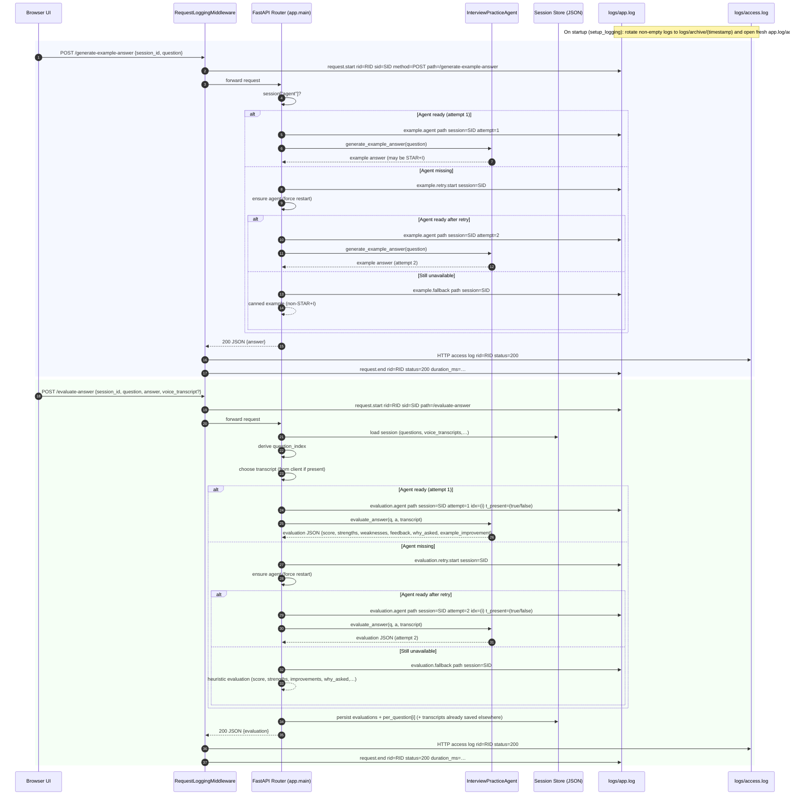

# Logging and Fallback Flow — Sequence Diagram

This diagram shows how requests are logged end‑to‑end and where the code chooses the “agent” vs “fallback” path for example generation and answer evaluation. Numbers in the diagram map to the legend below. Use `request_id` (rid) and optional `session_id` (sid) in `logs/app.log` and `logs/access.log` to correlate.



## How to Read the Logs
- Correlate using `rid` (request_id) printed in both app and access logs; `sid` (session_id) is added when available.
- Agent vs fallback lines in `logs/app.log`:
  - `example.agent path: session=…` or `example.fallback path: session=…`
  - `evaluation.agent path: session=… idx=… t_present=…` or `evaluation.fallback path: session=…`
- Access logs in `logs/access.log` record the HTTP line and status for each request with the same `rid`.

## When Fallback Happens
- `session["agent"]` is `None` (agent not started yet or failed) when requesting example/evaluation.
- Any exception inside the agent call also results in the fallback path (and logs an error line).

## Tips to Avoid Fallback for STAR+I Examples
- Wait until you see `Agent started for session …` in `logs/app.log` (or add a small UI guard).
- Make STAR+I mandatory in the agent prompt (not just “when applicable”).
- Provide `voice_transcript` alongside typed answers (already implemented) to keep parity with voice.

## Files and Rotation
- Live logs: `logs/app.log` (app + uvicorn/error), `logs/access.log` (HTTP access)
- Rotation: on each server start (including uvicorn reload), previous non‑empty logs are moved to `logs/archive/YYYY-MM-DD_HH-MM-SS/`.
```

## Legend (Autonumber Reference)
1. UI submits example request (POST /generate-example-answer)
2. Middleware logs `request.start` to app.log
3. Middleware forwards to FastAPI router
4. Router checks `session["agent"]`
5. Agent path chosen (attempt 1) → log `example.agent`
6. Router calls `InterviewPracticeAgent.generate_example_answer`
7. Agent returns LLM example answer
8. First attempt missing → log `example.retry.start`
9. `_ensure_agent_ready` restarts agent (force)
10. After retry, log `example.agent` attempt 2
11. Router calls agent again (attempt 2)
12. Agent returns example answer (attempt 2)
13. Both attempts failed → log `example.fallback`
14. Router prepares canned example answer (non‑STAR+I)
15. Router returns 200 response to middleware
16. Middleware logs access entry
17. Middleware logs `request.end` with status/duration
18. UI submits evaluation request (POST /evaluate-answer)
19. Middleware logs `request.start`
20. Middleware forwards request
21. Router loads session state from JSON store
22. Router computes question index
23. Router chooses transcript (client > stored)
24. Agent path log `evaluation.agent` (attempt 1)
25. Router calls `InterviewPracticeAgent.evaluate_answer`
26. Agent returns LLM evaluation JSON (attempt 1)
27. First attempt missing → log `evaluation.retry.start`
28. `_ensure_agent_ready` restarts agent (force)
29. After retry, log `evaluation.agent` (attempt 2)
30. Router calls agent again (attempt 2)
31. Agent returns evaluation JSON (attempt 2)
32. Both attempts failed → log `evaluation.fallback`
33. Router produces heuristic evaluation JSON
34. Router persists evaluation/per_question back to session store
35. Router returns 200 response to middleware
36. Middleware logs access entry
37. Middleware logs `request.end` with status/duration

Steps 8–14 and 27–33 execute only when the first attempt fails and the code retries before falling back.
```
```
