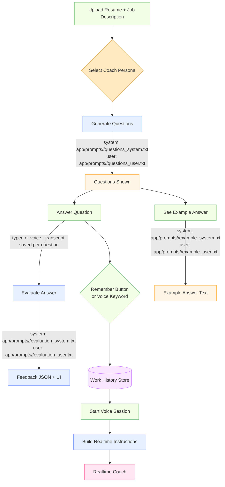

# Interview Practice App

## Context Recap
- Every bug fix must include automated test coverage and a manual run-through in the app to confirm the behaviour change.
- Front-end interactions should emit helpful `console.debug` traces whenever the UI state changes (persona switches, voice session lifecycle, document previews, etc.).
- Server logs should use descriptive event names and include relevant context (session ids, personas, counts) so troubleshooting is fast.
- Current UI regressions to verify and maintain:
  - Voice transcript pane must render both the coach’s prompts and the candidate’s replies.
  - “View Docs” needs to surface resume/job description previews instead of empty placeholders.
  - The home screen should auto-populate the most recent saved session so users can resume quickly.

## Overview
An AI-powered interview practice application that helps job seekers prepare for interviews by generating personalized questions, providing real-time feedback, and offering example answers.

## Features
- Resume upload plus job description file or text input
- AI-Generated Interview Questions
- Real-Time Answer Evaluation
- Markdown-Formatted Example Answers
- Tone and Content Feedback Analysis
- Session autosave with one-click resume
- Realtime Voice Interview Coach (OpenAI GPT Realtime + WebRTC)

## Session Flow Overview
```
+---------------------------+
| Upload Documents (form)   |
+-------------+-------------+
              |
              v
+-------------+-------------+        Persisted to
| Generate Questions API     |---+--> disk (`app/session_store/`)
+-------------+-------------+   |    + localStorage session id
              |                 |
              v                 |
+-------------+-------------+   |
| Practice Question UI       |<--+
|  - Answer textarea         |
|  - Voice session controls  |
+-------------+-------------+
              |
              v
+-------------+-------------+
| Evaluation Feedback panel  |
+-------------+-------------+
              |
              v
+-------------+-------------+
| Summary + Restart options  |
+-------------+-------------+
              |
     +--------+--------+
     | Resume Saved    |
     | Session banner  |
     +-----------------+
```
State is mirrored between the in-memory cache, JSON files under `app/session_store/`, and the browser’s `localStorage`. The upload screen surfaces a “Resume Saved Session” call-to-action whenever a session id is detected, enabling users to continue exactly where they left off.

### Saving & Resuming Sessions
1. Upload your resume and job description to start a new session. The server writes the session state to `app/session_store/<session_id>.json`, and the session id is cached in the browser.
2. Each time you generate questions, submit answers, or receive feedback, the latest progress is auto-saved—there is no extra “Save” button.
3. Return to the home page later: a banner above the upload form exposes **Resume Saved Session** (to reload) or **Clear Saved Session** (to delete the stored state).
4. Clearing or restarting removes the session id from both local storage and disk, letting you begin a fresh interview run.

## Prerequisites
- Python 3.9+
- pip
- Virtual Environment

## Setup Instructions
1. Clone the repository
```bash
git clone https://github.com/yourusername/interview-practice-app.git
cd interview-practice-app
chmod +x run.sh run_voice.sh test.sh kill.sh
```

2. Configure Environment Variables
Copy `.env.example` to `.env`, then add your OpenAI API key:
```bash
cp .env.example .env
```
Update `.env` with your token (and override realtime model/voice if desired).

3. Run the Application
```bash
./run.sh
```
The script creates/activates the virtual environment (if missing), installs dependencies, and starts the development server with auto-reload by default. Use `./run_voice.sh` when you want to skip evaluation and jump straight into the realtime coaching flow.
When the UI loads, upload your resume and either attach a job description file or paste its text directly into the job description field.

4. Install UI testing dependencies (optional, for browser automation)
```bash
source venv/bin/activate  # created by ./run.sh
pip install -r requirements-dev.txt
```
When running the UI tests, ensure the server is reachable at `http://localhost:8000` (the default). Override `UI_BASE_URL` before invoking `./run_usertests.sh` if you run on a different port.

## Helper Scripts
- `./run.sh`: Boots the FastAPI server. Add `--no-reload` to disable auto-reload or `--python 3.11` to select a Python version.
- `./run_voice.sh`: Same as `run.sh`, but prints realtime voice config details; handy when testing the WebRTC/audio flow exclusively.
- `./test.sh`: Runs the test suite with `pytest -q`. Use `--health` to ping the running server (`http://localhost:8000` by default) after tests, or override the health-check target with `--url <base_url>`.
- `./run_usertests.sh`: Installs Helium/Selenium UI dependencies from `requirements-dev.txt` and runs the browser smoke tests in `tests/ui/`. Set `UI_BASE_URL` if the app is not on `http://localhost:8000`. The script writes a Markdown summary to `tests/ui/__artifacts__/usertests_report.md` plus raw logs in `usertests.pytest.log`.

## Contributor Toolkit
- `references/` contains the shared refactoring and operational playbooks (`advanced_topics.md`, `best_practices.md`, etc.) so engineers can align on safe cleanup patterns while working in the app.
- `scripts/` holds automation that enforces the playbook: `analyze_code.py` surfaces long functions/deep nesting before refactors, and `refactor_code.py` applies targeted AST cleanups.
- `templates/` packages code/test scaffolds referenced in the playbook. Use them to spin up new helpers, routers, or focused pytest modules that match the repo style.
- `tests/api/` and `tests/ui/` provide the baseline regression coverage for session flows and front-end persona defaults. Each module includes high-level docstrings explaining the scenarios they guard.

## Realtime Voice Interviews
- Upload your resume and job description to start a session, then click **Start Voice Session** to open a WebRTC call with the `gpt-realtime-mini-2025-10-06` coach.
- The browser will prompt for microphone access—grant permission so the agent can hear you.
- Conversation summaries stream into the transcript panel while audio plays through the embedded `<audio>` element.
- Use **Stop Voice Session** to release the connection, or restart the interview to reset the voice UI.
- Voice persona system prompts live at `app/prompts/<persona>/voice_system.txt`; edit these files to update realtime instructions per persona.

### Voice Turn Detection (VAD) settings
You can control server-side turn detection behavior via environment variables in `.env`:

- `OPENAI_TURN_DETECTION` = `server_vad` (default) or `none`
- `OPENAI_TURN_THRESHOLD` = `0.5` (float string)
- `OPENAI_TURN_PREFIX_MS` = `300` (milliseconds)
- `OPENAI_TURN_SILENCE_MS` = `500` (milliseconds)

These map to the Realtime session `turn_detection` payload. Set values, restart the server, and start a new voice session to apply.

## Technologies Used
- FastAPI
- OpenAI GPT
- Tailwind CSS
- Showdown.js
- Python libraries (PyPDF2, python-docx, scikit-learn, nltk)

## Contributing
1. Fork the repository
2. Create your feature branch (`git checkout -b feature/AmazingFeature`)
3. Commit your changes (`git commit -m 'Add some AmazingFeature'`)
4. Push to the branch (`git push origin feature/AmazingFeature`)
5. Open a Pull Request

## License
Distributed under the MIT License. See `LICENSE` for more information.

## Contact
Taylor Parsons - taylor.parsons@gmaio.com


---

## Lean Canvas

| Problem | Solution | Unique Value Proposition | Unfair Advantage | Customer Segments |
|---------|----------|--------------------------|------------------|-------------------|
| - Job seekers struggle with interview preparation<br>- Lack of personalized practice<br>- Difficulty receiving constructive feedback | - Question generation from job descriptions and resumes<br>- Real-time feedback on answers<br>- Resume-based example answers | - Personalized interview questions and feedback<br>- Real-time interaction using AI analysis<br>- Comprehensive practice tool | - Advanced AI models for evaluation<br>- Personalized adaptive feedback | - Job seekers<br>- Career coaches<br>- Educational institutions |

| Channels | Revenue Streams | Cost Structure | Key Metrics |
|----------|----------------|----------------|-------------|
| - Online platforms<br>- Career service partnerships<br>- Digital marketing | - Subscription model<br>- One-time purchases<br>- Institutional partnerships | - Development and maintenance<br>- AI model licensing<br>- Marketing costs | - Active users<br>- Engagement metrics<br>- Conversion rates |

---

## Technical Requirements Document

### 1. File Upload Capability
- **User Given**: As a user, I want to upload a job description and my resume easily.
- **When**: The user uploads these documents, they should be stored securely for processing.
- **Outcome**: Documents are used to tailor the interview questions specifically to the job description and user's experience.

### 2. Question Generation
- **User Given**: As a user, I want relevant interview questions generated from my resume and the job description.
- **When**: The user uploads documents, the system should analyze them instantly.
- **Outcome**: A set of personalized interview questions is generated and presented to the user.

### 3. User Answer Interaction
- **User Given**: As a user, I want to answer interview questions interactively.
- **When**: The system presents a question, the user should be able to respond easily.
- **Outcome**: The system records user answers for evaluation.

### 4. Answer Evaluation
- **User Given**: As a user, I want my answers evaluated for content and tone.
- **When**: The user submits an answer, it should be analyzed immediately.
- **Outcome**: The system provides feedback on the content accuracy and tone of the response.

### 5. Feedback Mechanism
- **User Given**: As a user, I want to receive constructive feedback to improve my responses.
- **When**: Feedback is provided after each answer.
- **Outcome**: Feedback highlights strengths, weaknesses, and suggestions for improvement.

### 6. Resume-Based Answering
- **User Given**: As a user, I want the app to answer questions using my resume as a source.
- **When**: The user asks how the app would respond to a question based on the resume.
- **Outcome**: The app generates a response using relevant information from the resume, demonstrating potential answers.

### 7. UI Smoke Tests (Helium)
- **Test Scenario**: Verify the landing page renders the document upload form and key controls.
- **Expected Outcome**: Elements such as Resume/Job Description inputs, job description textarea, and `Start Interview Practice` CTA exist once the page loads.
- **Run Command**: Ensure the FastAPI server is running on `http://localhost:8000` (default from `./run.sh`), then execute `./run_usertests.sh` (override `UI_BASE_URL` or set `HEADFUL_UI_TESTS=1` for visible browser runs). Review the journey-focused summary at `tests/ui/__artifacts__/usertests_report.md` and screenshots in the per-test flow folders under the same directory.

---

## Test Document

### 1. File Upload Capability
- **Test Scenario**: Verify that users can upload job descriptions and resumes in various formats (e.g., PDF, DOCX).
- **Expected Outcome**: The app accepts the files, stores them securely, and they can be accessed for question generation.

### 2. Question Generation
- **Test Scenario**: Check if relevant interview questions are generated based on the uploaded job description and resume.
- **Expected Outcome**: The app generates a set of questions that align with the job requirements and the user's qualifications.

### 3. User Answer Interaction
- **Test Scenario**: Confirm that users can interactively answer the generated interview questions.
- **Expected Outcome**: Users should be able to submit answers without errors, and the answers are recorded in the system.

### 4. Answer Evaluation
- **Test Scenario**: Validate that the app evaluates the content and tone of user answers.
- **Expected Outcome**: Each answer is analyzed, and feedback is provided regarding content accuracy and tone appropriateness.

### 5. Feedback Mechanism
- **Test Scenario**: Ensure that users receive constructive feedback after each answer.
- **Expected Outcome**: Feedback should highlight areas for improvement and provide specific suggestions.

### 6. Resume-Based Answering
- **Test Scenario**: Test the app's ability to answer questions using the user's resume as a factual source.
- **Expected Outcome**: The app should generate accurate responses based on the resume, demonstrating potential answers to interview questions.

## Work History Knowledge Store (Vector Search)

Add your past projects and accomplishments as a reusable knowledge pool. The voice coach will surface the most relevant snippets during mock interviews.

- Storage: FAISS index at `app/knowledge_store/work_history.faiss` with metadata in `work_history_meta.json` (ignored by git)
- Engine: OpenAI embeddings (`OPENAI_EMBEDDING_MODEL`, default `text-embedding-3-small`) + FAISS cosine similarity

### API
- `GET /work-history` — stats for the store
- `POST /work-history/add` — add chunks
  - Body: `{ "chunks": [ { "text": "...", "metadata": {"role": "SWE"} }, ... ] }`
- `POST /work-history/import-path` — import from a local file/dir
  - Body: `{ "path": "/absolute/or/relative/path" }`
  - Supports `.txt`/`.md` (blank-line paragraphs), `.jsonl` (per-line object with `text`/`content`), `.json` (array or `{"chunks": [...]}`)
- `GET /work-history/search?q=...&k=5` — search snippets
- `DELETE /work-history` — clear the store

### Example: Import a chunked folder
If your data lives at `/Volumes/T9/Users/taylorparsons/code/interview_app/chunks`:
```bash
curl -X POST http://localhost:8000/work-history/import-path \
  -H 'Content-Type: application/json' \
  -d '{"path": "/Volumes/T9/Users/taylorparsons/code/interview_app/chunks"}'
```

### How recall is used in voice coaching
When creating a realtime voice session, the server fetches the top 5 snippets using the first interview question as the query and injects them under “Work History Knowledge Pool” in the system instructions sent to the voice agent.

If embeddings/FAISS are unavailable, the app falls back to a local lexical TF‑IDF store at `app/knowledge_store/work_history.json` with the same API shape.

### Migration from earlier lexical store
If you previously used the JSON-backed lexical store at `app/knowledge_store/work_history.json`, the server will automatically migrate those chunks into the FAISS index on first use.

## Coach Personas

Pick a coaching style for both text and voice flows:

- Ruthless Coach: strict, high‑bar, precision‑focused evaluator.
- Helpful Coach: constructive and encouraging with actionable tips.
- Discovery Coach: elicits STAR+I narratives from work history to build story inventory.

Default
- New sessions and the UI default to Discovery Coach. You can change the persona anytime from the selector or via the API.

How to switch:
- UI: use the “Coach persona” selector in the Voice Interview Coach panel.
- API: `PATCH /session/{id}/coach` with `{ "persona": "ruthless" | "helpful" | "discovery" }`

Prompts are editable on disk (no code changes). For each persona, files live under:
- `app/prompts/<persona>/questions_system.txt` and `questions_user.txt`
- `app/prompts/<persona>/evaluation_system.txt` and `evaluation_user.txt`
- `app/prompts/<persona>/example_system.txt` and `example_user.txt`

Supported placeholders in user templates:
- Questions: `{resume_text}`, `{job_description_text}`, `{num_questions}`
- Evaluation: `{question}`, `{answer}`, `{voice_transcript_block}`
- Example: `{question}`, `{resume_text}`, `{job_description_text}`

Changes take effect on the next request (with `uvicorn --reload`).

## Remember Snippets (Build Your Knowledge Pool)

Save parts of your spoken answer into the work‑history store for later recall.

- UI button: “Remember” next to voice controls saves the current question’s transcript (summarized with STAR+I).
- Voice keyword: say “remember that/this/it/the last part” to trigger the same action; the agent will acknowledge.
- API: `POST /session/{session_id}/voice-transcript/memorize`
  - Body: `{ "question_index": 0, "summarize": true, "metadata": {"topic": "leadership"} }`
  - Or: `{ "text": "raw transcript...", "summarize": false }`

Verify and debug:
- `GET /work-history` and `GET /work-history/search?q=...&k=5`
- Logs in `logs/app.log`: `knowledge.memorize.start/end`, `knowledge.search.start/end`, `knowledge.import.*`

## Prompt Flow



Notes
- `<persona>` is one of `ruthless | helpful | discovery`.
- If a prompt file is missing, the app falls back to built‑in defaults.
- The voice session does not use the above per‑task files; it composes a single instruction string from the selected persona plus the top matches from your work‑history store.
- Realtime instructions combine the persona prompt and retrieved work-history snippets before reaching the realtime coach.
- Colors indicate interaction type: green for user actions, blue for system processing, amber for UI display, violet for stored data, gold for decision points, and pink for the realtime agent.
