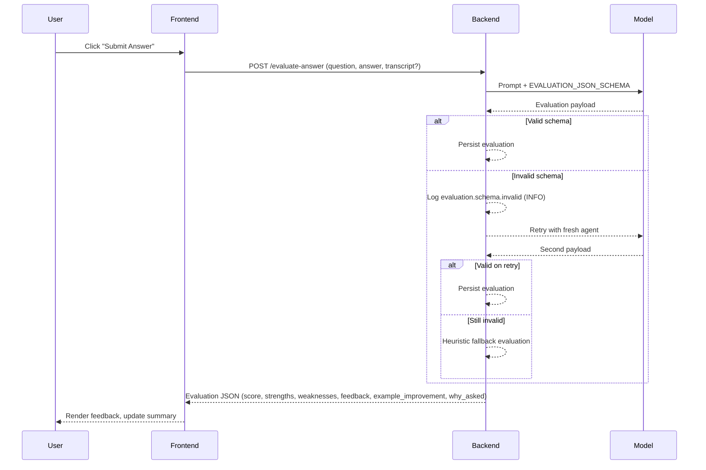
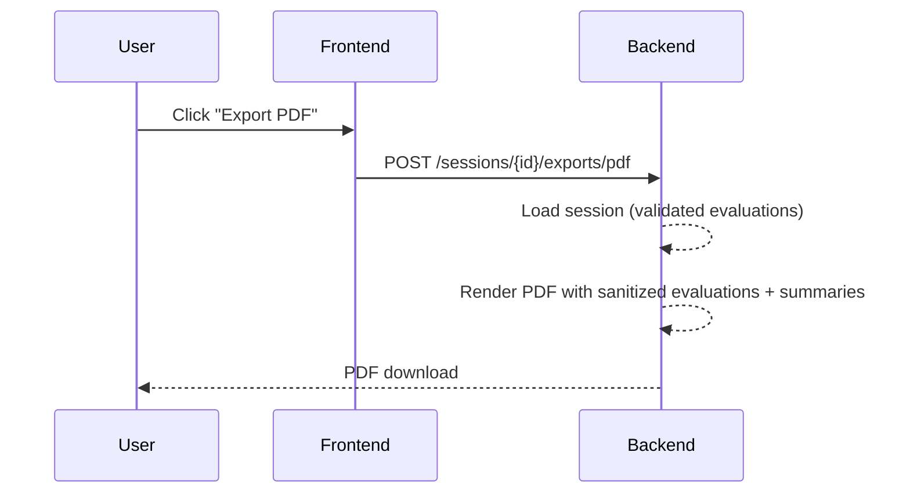

# Evaluation Schema Enforcement Rollout

## Summary
We now explicitly embed and validate a JSON schema for interview answer evaluations. The prompt sent to the model includes the schema, and server-side validation enforces it. Invalid payloads trigger minimal retries (two attempts total) and a heuristic fallback, logged at INFO (`evaluation.schema.invalid`), preventing noisy warnings/errors.

- Prompt schema: `app/models/interview_agent.py` (`EVALUATION_JSON_SCHEMA`)
- Validation + fallback: `app/main.py` (`_validate_evaluation_payload` + retry loop in `/evaluate-answer`)
- Tests: `tests/test_evaluation_prompt_schema.py` (schema included in prompt) and `tests/test_evaluate_answer_schema.py` (invalid payload -> retries + fallback at INFO)
- Plan reference: docs/plans/2025-11-25-voice-phase-plan.md (post-release TODO now addressed)

## When it runs
1. User submits an answer (typed or voice) → frontend calls `POST /evaluate-answer`.
2. Backend fetches session, prepares model call with schema in the prompt.
3. Model response is validated against the schema.
   - If valid → persisted as-is.
   - If invalid → log `evaluation.schema.invalid` at INFO, retry once with a fresh agent init.
   - If still invalid → fall back to heuristic evaluation (score + strengths/weaknesses/etc.).
4. Response returned to the client; persisted to session for PDF/export/UI summary.

## Sequence (user perspective)

## Sequence (PDF/export path)

## Notes on models/support
- Schema is embedded directly in the prompt; applies to all configured models (gpt-4o-mini, gpt-5-mini, gpt-5) without additional per-model settings.
- Validation is model-agnostic; any model returning malformed JSON will be retried then fallbacked.

## Files touched
- `app/models/interview_agent.py`: schema definition and prompt injection.
- `app/main.py`: evaluation validation, retries, fallback, info-level logging.
- Tests: `tests/test_evaluation_prompt_schema.py`, `tests/test_evaluate_answer_schema.py`.

## Status vs plan
- docs/plans/2025-11-25-voice-phase-plan.md post-release TODO “tighten evaluation prompt + JSON schema enforcement…” is now completed.
