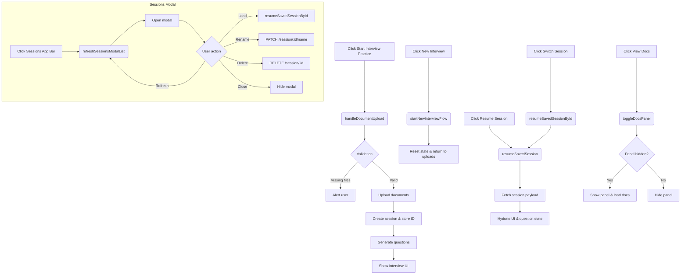
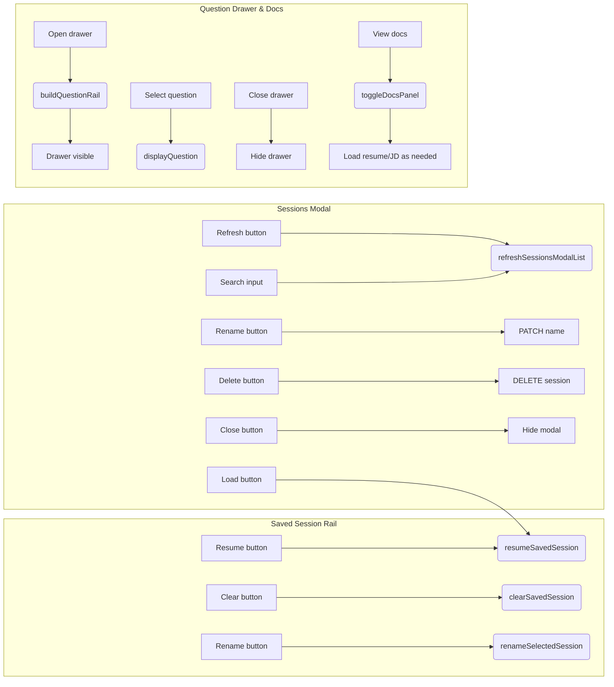

# Call-to-Action Reference & Mermaid Interaction Maps

## Overview
This document enumerates every call-to-action (CTA) exposed in the Veneo Inc. interview practice experience and shows how each user input propagates through the front-end workflow. The goal is to make it easier to reason about compartmentalizing features (e.g., adding new agent teams or parameter sets) by understanding which handlers, API calls, and UI regions are touched by each CTA.【F:app/static/js/app.js†L1727-L1784】【F:app/static/js/app.js†L2372-L2441】

## CTA Inventory
The tables below group CTAs by the portion of the experience they affect. Each entry links the surface element to its primary handler and summarizes the downstream effects so that new functionality can be routed without cross-coupling unrelated areas.

### Global Bar, Upload, and Session Management
| CTA | Element | Handler(s) | Primary effect |
| --- | --- | --- | --- |
| Start Interview Practice | `#upload-form` submit | `handleDocumentUpload` | Validates uploads, persists a new session, generates interview questions, and transitions into the interview UI.【F:app/static/js/app.js†L1727-L1744】【F:app/static/js/app.js†L2372-L2441】 |
| New Interview | `#global-new-interview` button | `startNewInterviewFlow` | Resets state, clears session storage, and returns the user to the upload screen to restart the flow.【F:app/static/js/app.js†L1580-L1584】【F:app/static/js/app.js†L3038-L3071】 |
| Resume Saved Session | `#resume-session` button | `resumeSavedSession` | Loads the selected session, restores questions/answers, and rehydrates the interview UI state.【F:app/static/js/app.js†L1704-L1710】【F:app/static/js/app.js†L2206-L2336】 |
| Delete Saved Session | `#clear-session` button | `clearSavedSession` | Confirms deletion, removes the session via API, updates storage, and restarts if the current session is removed.【F:app/static/js/app.js†L1712-L1717】【F:app/static/js/app.js†L2338-L2369】 |
| Rename Saved Session | `#rename-session` button | `renameSelectedSession` | Validates the new name, patches it server-side, and refreshes the session lists so other controls stay in sync.【F:app/static/js/app.js†L1719-L1724】【F:app/static/js/app.js†L2067-L2106】 |
| Switch Session | `#switch-session` button | `resumeSavedSessionById` | Pulls the chosen session into view without a full reload, sharing the same resume logic as the primary resume CTA.【F:app/static/js/app.js†L1773-L1779】【F:app/static/js/app.js†L2331-L2336】 |
| Open Sessions Modal | `#global-sessions` button | inline listener → `refreshSessionsModalList` | Populates the modal picker and reveals the session-management overlay.【F:app/static/js/app.js†L1583-L1588】【F:app/static/js/app.js†L3120-L3137】 |
| Close Sessions Modal | `#close-sessions` button | inline listener | Hides the modal without mutating session data.【F:app/static/js/app.js†L1595-L1597】 |
| Refresh Sessions List | `#sessions-refresh` button | `refreshSessionsModalList` | Re-queries the session catalog, respecting any search filter in the modal.【F:app/static/js/app.js†L1598-L1600】【F:app/static/js/app.js†L3120-L3137】 |
| Load Session (modal) | `#sessions-load` button | `resumeSavedSessionById` | Loads the highlighted session directly from the modal, then closes it for a seamless resume workflow.【F:app/static/js/app.js†L1604-L1611】【F:app/static/js/app.js†L2331-L2336】 |
| Rename Session (modal) | `#sessions-rename` button | inline listener → PATCH request | Applies a new name to the selected session and refreshes modal listings to reflect the change.【F:app/static/js/app.js†L1612-L1623】 |
| Delete Session (modal) | `#sessions-delete` button | inline listener → DELETE request | Confirms removal, calls the deletion endpoint, and refreshes in-memory lists across the UI.【F:app/static/js/app.js†L1625-L1637】 |
| View Docs | `#view-docs` button | `toggleDocsPanel` | Toggles the resume/job description drawer, lazily fetching documents the first time it opens for the active session.【F:app/static/js/app.js†L1782-L1784】【F:app/static/js/app.js†L2206-L2220】 |
| Sessions Search | `#sessions-search` input | inline input listener → `refreshSessionsModalList` | Filters modal entries reactively so the load/rename/delete CTAs target the intended session.【F:app/static/js/app.js†L1601-L1603】【F:app/static/js/app.js†L3120-L3137】 |

### Interview Navigation, Feedback, and Question Map
| CTA | Element | Handler(s) | Primary effect |
| --- | --- | --- | --- |
| Submit Answer | `#submit-answer` button | `handleAnswerSubmission` | Validates the typed response, POSTs it for evaluation, stores feedback, and shows the feedback view.【F:app/static/js/app.js†L1731-L1734】【F:app/static/js/app.js†L2528-L2598】 |
| Speak Your Answer | dynamically injected `#mic-button` | `toggleRecording` | Toggles browser ASR fallback recording, reflecting status changes in the UI and transcript buffer.【F:app/static/js/app.js†L1420-L1499】 |
| Get Example Answer | `#get-example` button | `handleGetExample` | Requests a model-crafted example, reveals the example panel, and scrolls it into view.【F:app/static/js/app.js†L1736-L1739】【F:app/static/js/app.js†L2808-L2845】 |
| Next Question (primary) | `#next-question` button | `handleNextQuestion` | Advances to the next question or switches to the summary when the set is exhausted.【F:app/static/js/app.js†L1741-L1744】【F:app/static/js/app.js†L2848-L2854】 |
| Back to Interview | `#back-to-interview` button | inline listener | Closes the example panel and restores the main interview layout.【F:app/static/js/app.js†L1746-L1757】 |
| Restart Interview | `#restart-interview` button | `handleRestartInterview` | Clears session state, resets forms, and returns to the upload stage.【F:app/static/js/app.js†L1760-L1763】【F:app/static/js/app.js†L3038-L3061】 |
| Previous Question | `#prev-question` button | inline listener → `displayQuestion` | Moves backward in the question list when possible, keeping summaries in sync.【F:app/static/js/app.js†L1648-L1649】【F:app/static/js/app.js†L2475-L2505】 |
| Next Question (footer) | `#next-question-footer` button | `handleNextQuestion` | Provides redundant forward navigation from the sticky footer for parity with keyboard shortcuts.【F:app/static/js/app.js†L1648-L1650】【F:app/static/js/app.js†L2848-L2854】 |
| Mark for Review | `#mark-review` button | `toggleMarkForReview` | Toggles the review flag for the current prompt and refreshes both question lists with updated badges.【F:app/static/js/app.js†L1649-L1650】【F:app/static/js/app.js†L3120-L3126】【F:app/static/js/app.js†L3082-L3107】 |
| Open Question Drawer | `#open-question-drawer` button | inline listener → `buildQuestionRail` | Rebuilds the list of questions and exposes the mobile drawer for quick navigation.【F:app/static/js/app.js†L1639-L1643】【F:app/static/js/app.js†L3082-L3107】 |
| Close Question Drawer | `#close-question-drawer` button | inline listener | Hides the drawer and returns focus to the main interview pane.【F:app/static/js/app.js†L1644-L1647】 |
| Jump to Question | Drawer/Rail list items | inline listener inside `buildQuestionRail` | Navigates to the selected question, closing the drawer on mobile to maintain context.【F:app/static/js/app.js†L3089-L3107】 |
| Next Question (summary) | `#next-question` button while in summary | `handleNextQuestion` | From the feedback view, advancing triggers the same logic as the primary button to reach the summary or next prompt.【F:app/static/js/app.js†L1741-L1744】【F:app/static/js/app.js†L2848-L2854】 |

### Voice Coaching & Transcript Utilities
| CTA | Element | Handler(s) | Primary effect |
| --- | --- | --- | --- |
| Start Voice Session | `#start-voice` button | `startVoiceInterview` | Negotiates a realtime session, initializes WebRTC, and streams the opening prompt from the coach agent.【F:app/static/js/app.js†L1765-L1767】【F:app/static/js/app.js†L1088-L1186】 |
| Stop Voice Session | `#stop-voice` button | `stopVoiceInterview` | Tears down realtime streams, updates UI state, and preserves status when invoked from unload handlers.【F:app/static/js/app.js†L1768-L1771】【F:app/static/js/app.js†L1241-L1281】 |
| Submit Voice Answer | `#submit-voice-answer` button | `handleVoiceAnswerSubmission` | Sends the latest transcript for evaluation, persists it like a typed answer, and renders feedback.【F:app/static/js/app.js†L1573-L1576】【F:app/static/js/app.js†L1294-L1343】 |
| Mute/Unmute Coach | `#mute-voice` button | `toggleMuteVoice` | Toggles local microphone tracks and updates the button label to reflect the current state.【F:app/static/js/app.js†L1577-L1579】【F:app/static/js/app.js†L3074-L3079】 |
| Export Transcript | `#export-transcript` button | `exportFullTranscript` | Aggregates saved voice messages and transcripts, normalizes ordering, and triggers a download-ready payload.【F:app/static/js/app.js†L1570-L1572】【F:app/static/js/app.js†L1967-L2045】 |
| Open Voice Settings (panel) | `#open-voice-settings` button | inline listener → `populateVoiceSettingsDrawer` | Loads the catalog of voices/settings and shows the in-session settings drawer.【F:app/static/js/app.js†L1651-L1655】【F:app/static/js/app.js†L3158-L3195】 |
| Open Voice Settings (app bar) | `#global-settings` button | inline listener → `populateVoiceSettingsDrawer` | Shares the same workflow as the panel button, providing access even before starting voice mode.【F:app/static/js/app.js†L1589-L1593】【F:app/static/js/app.js†L3158-L3195】 |
| Close Voice Settings Drawer | `#close-voice-settings` button | inline listener | Hides the voice settings drawer without mutating preferences.【F:app/static/js/app.js†L1656-L1658】 |
| Voice Preview (panel) | `#voice-preview` button | inline listener within `initVoiceSelector` | Streams an audio preview for the selected coach voice while handling loading states and playback cleanup.【F:app/static/js/app.js†L1800-L1845】 |
| Save Voice (panel) | `#voice-save` button | inline listener within `initVoiceSelector` | Persists the selected coach voice, optionally restarts an active session so changes take effect immediately.【F:app/static/js/app.js†L1846-L1884】 |
| Voice Preview (drawer) | `#voice-preview-2` button | inline listener → `populateVoiceSettingsDrawer` | Ensures the voice list is loaded, then plays a preview inside the drawer UI.【F:app/static/js/app.js†L1660-L1673】 |
| Save Voice (drawer) | `#voice-save-2` button | inline listener → PATCH request | Saves the drawer selection with the same restart prompt shown in the panel flow.【F:app/static/js/app.js†L1674-L1694】 |
| Retry Voice Catalog | `#voice-select-2-retry` button | inline `onclick` injection | Re-attempts to load available voices when the initial fetch fails, keeping the drawer recoverable.【F:app/static/js/app.js†L3189-L3194】 |
| Save Coach Level | `#coach-level-save` button | inline listener → PATCH request | Persists the selected coaching strictness level so subsequent prompts adopt the new tone.【F:app/static/js/app.js†L1941-L1962】 |
| Submit Voice Answer Availability | `#submit-voice-answer` button state | `updateVoiceSubmitAvailability` | Enables or disables the submit CTA based on transcript length, ensuring the evaluation endpoint receives meaningful input.【F:app/static/js/app.js†L1282-L1292】 |

### Supportive UI & Drawer Flows
| CTA | Element | Handler(s) | Primary effect |
| --- | --- | --- | --- |
| Sessions Count Controls | Resume rail select list | `updateResumeControlsVisibility` | Shows or hides the saved-session rail so CTA exposure matches actual data availability.【F:app/static/js/app.js†L2053-L2099】 |
| Keyboard Shortcuts | `document` keydown | inline listener | Mirrors CTA behavior for power users (next, previous, toggle voice, mute, export, open drawer) to keep flows consistent across input methods.【F:app/static/js/app.js†L3198-L3218】 |

## Interaction Diagrams
The following Mermaid diagrams consolidate how related CTAs collaborate within each functional slice of the experience. Use them to identify where future feature compartments should intercept or extend the flow without leaking responsibilities across modules.

### Figure 1 — Global & Session Lifecycle


### Figure 2 — Interview Navigation & Feedback
```mermaid
flowchart LR
    subgraph Answer Cycle
        A[Submit Answer] --> B(handleAnswerSubmission)
        B --> C[POST /evaluate-answer]
        C --> D[Store answer & evaluation]
        D --> E[displayFeedback]
        E --> F[Feedback panel visible]
        G[Click Back to Interview] --> H[Hide example panel]
        H --> I[Show interview container]
    end
    subgraph Question Controls
        J[Click Next Question] --> K(handleNextQuestion)
        K --> L{More questions?}
        L -- Yes --> M[displayQuestion(next)]
        L -- No --> N[displaySummary]
        O[Click Previous Question] --> P[displayQuestion(previous)]
        Q[Click Mark for Review] --> R(toggleMarkForReview)
        R --> S[buildQuestionRail]
        T[Open Question Drawer] --> S
        U[Question List Item] --> V[displayQuestion(selected)]
        W[Close Drawer] --> X[Hide drawer]
    end
    subgraph Example Flow
        Y[Get Example Answer] --> Z(handleGetExample)
        Z --> AA[POST /generate-example-answer]
        AA --> AB[displayExampleAnswer]
        AB --> AC[Reveal example section]
    end
    subgraph Summary Loop
        AD[Restart Interview] --> AE(handleRestartInterview)
        AE --> AF[Reset to uploads]
    end
```

### Figure 3 — Voice Coaching Controls
```mermaid
flowchart TD
    subgraph Session Lifecycle
        A[Start Voice Session] --> B(startVoiceInterview)
        B --> C[POST /voice/session]
        C --> D[Establish WebRTC]
        D --> E[Receive coach prompt]
        F[Stop Voice Session] --> G(stopVoiceInterview)
        G --> H[Close peer connection]
        H --> I[Update UI status]
    end
    subgraph Transcript Submission
        J[Speak Your Answer mic] --> K(toggleRecording)
        K --> L{Recording?}
        L -- Start --> M[startRecording]
        L -- Stop --> N[stopRecording]
        O[Submit Voice Answer] --> P(handleVoiceAnswerSubmission)
        P --> Q[POST /evaluate-answer]
        Q --> R[Store transcript & evaluation]
        R --> S[displayFeedback]
        T[Mute/Unmute] --> U(toggleMuteVoice)
        V[Export Transcript] --> W(exportFullTranscript)
    end
    subgraph Voice Settings
        X[Open Voice Settings] --> Y(populateVoiceSettingsDrawer)
        Y --> Z{Catalog load}
        Z -- Success --> AA[Drawer visible]
        Z -- Fail --> AB[Show retry button]
        AB --> Y
        AC[Preview Voice (panel/drawer)] --> AD[Play preview audio]
        AE[Save Voice (panel/drawer)] --> AF[PATCH /session/:id/voice]
        AF --> AG{Voice session active?}
        AG -- Yes --> AH[Offer restart]
        AG -- No --> AI[Alert saved]
        AJ[Save Coach Level] --> AK[PATCH /session/:id/coach-level]
    end
```

### Figure 4 — Modal & Drawer Ecosystem


## Compartmentalization Notes
The diagrams highlight natural seams for compartmentalizing new feature teams:

* **Session lifecycle module** – encapsulate upload, resume, modal management, and document viewing so that new agent teams can plug into a well-defined “session activated” event bus without touching question logic.【F:app/static/js/app.js†L1580-L1784】【F:app/static/js/app.js†L2206-L2441】
* **Interview workflow module** – isolate question rendering, navigation, evaluation submission, and review flags, making it easier to layer specialized agent behaviors (e.g., general chat vs. technical drill-down) behind the same CTA contract.【F:app/static/js/app.js†L2528-L3126】
* **Voice coaching module** – treat realtime voice, transcripts, and voice settings as a distinct subsystem that can be swapped or extended for alternate agent parameter sets without perturbing core interview flows.【F:app/static/js/app.js†L1088-L2045】【F:app/static/js/app.js†L3074-L3218】

Each module can publish events (e.g., `session:loaded`, `question:advanced`, `voice:state-changed`) consumed by specialized agent teams, allowing multiple parameterized agents to coexist while sharing the existing CTA surfaces.
